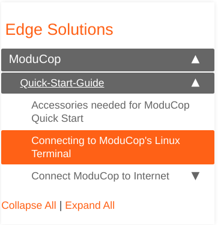
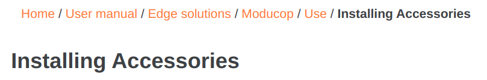

The repository contains a lot of stuff, but only a view directories are required for documentation adaption:
```
└── docs
    ├── ...
    ├── _data <----------------- Contains the main menu displayed on the top of the webside
    │   └── sidebars <---------- Contains the sidebar and subsidebars
    ├── ...
    └── user-docs <-------------- This contains the actual user documentation
        ├── _drafts <------------ Containts example file
        ├── _posts <------------- Place here articles for the news section
        ├── _quick-start-guide <- Place here doc files from quick start guide section
        ├── _user-manual <------- Place here doc files from user manual section
        ├── _video-categories <-- Place here files to group videos in categories
        └── _videos <------------ Place here files to point to videos in well known video platforms
        └── images <------------- Place here images required for your documentation
```

> Please [run theme locally](#run-theme-locally) to see how your changes will behave on the production website.

> Please ensure to install pre-commit hooks every new checkout of the repository to ensure a minimum level of quality every commit. See [Pre-Commit Hooks](#pre-commit-hooks) for install instructions.

> For inspiration what can be done with doc pages in this template have a look at the [example page](../_drafts/example.md) which is generated to [http://localhost:4000/example/](http://localhost:4000/example/) when running the server with `--drafts` option.

> Don't use more than 5 heading depths.

# Naming Conventions

**For Page Titles and Menu Items:**

* Use well known practices to define a page title, see e.g. [How to Write a News Article: Headlines](https://spcollege.libguides.com/c.php?g=254319&p=1695321).
* Also consider correct capitalizing for headlines, see e.g. [How Should I Capitalize my Headlines](https://www.hipb2b.com/blog/how-should-i-capitalize-my-headlines).


**For File Names and Folders (and so for urls):**

- Use only small letters
- Do NOT USE SPACES!
- No special characters
- Separate words with `-` e.g. "total great stuff" -> total-great-stuff
- Naming shall reflect the content
- Name of doc page file shall contain title, but shorts can be used e.g. title: `Develop Applications`, file name: `develop-apps.md`

# How-To's
## How to Modify a Page
Assume that the website has the following sidebar and you want to customize the page marked in orange:



Get the url of the page to find the page in the directory structure:
<div class="language-plaintext highlighter-rouge">
<pre><code>http://localhost:4000/<strong style="color:red">user-manual/edge-solutions/moducop/use/installing-accessories</strong>/
</code></pre></div>

All docs are stored in docs/user-docs/ and grouped by the category, which has to start with `_`:

<div class="language-plaintext highlighter-rouge">
<pre><code>docs/user-docs/_<strong style="color:red">user-manual/edge-solutions/moducop/use/installing-accessories</strong>.md
</code></pre></div>

Each docuentation file has a YAML front matter at the top, eg.:

```yaml
---
title: Installing Accessories
excerpt: How to install accessories on ModuCop.
last_modified_at: 2021-04-13
---
```

This is used to define page metadata:
* **title:** Headline of the page, shown at the top of the page below the breadcrumps and in the browser tab
* **excerpt:** A short description of the page content
* **last_modified_at:** Needs to be updated manually and shows when the page was updated the last time

Add the content below the front matter.

## How to Add Figures
See the section `Include Figure` from [example page markdown](../_drafts/example.md#include-figure) / [generated example page](http://localhost:4000/example/#include-figure) to see how to add figures into the page.

Documentation figures are stored in `docs/user-docs/images`. Feel free to store the pictures in a structured way within folders.

> Please consider [naming conventions](#naming-conventions) for file name selection.

> Do not add pictures greater than > 500 KB.

Path to the figure needs to be calculated from `docs` as root folder: Image `docs/user-docs/images/super-image.jpg` results in url `/user-docs/images/super-image.jpg`.


## How to Add a Page
Assume that the website has the following sidebar and you want to add another page with the title `Demonstration Page` after the page highlighted in orange on the same level:


Get the url of the page to find the page in the directory structure:
<div class="language-plaintext highlighter-rouge">
<pre><code>http://localhost:4000/<strong style="color:red">user-manual/edge-solutions/moducop/use/installing-accessories</strong>/
</code></pre></div>

All docs are stored in docs/user-docs/ and grouped by the category, which has to start with `_`:

<div class="language-plaintext highlighter-rouge">
<pre><code>docs/user-docs/_<strong style="color:red">user-manual/edge-solutions/moducop/use/installing-accessories</strong>.md
</code></pre></div>

Add a file in the same directory and give it a name in the format `[TITLE_SMALL_WITH_SLASH].md`, where `TITLE_SMALL_WITH_SLASH` shall be the title converted in small letters where spaces are replaced with `-`. Shorts can be used to keep URL short, as file names are used to generate the URL.

So a good name for our examle file would be `demo-page.md`.

The next step is to add a front matter at the top of the file:
```yaml
 ---
title: Demonstration Page
excerpt: This is a page for demonstration.
last_modified_at: 2021-04-21
 ---
```

Already now, the page can be visited on the homepage, as the filename defines the url together with the filepath:
<div class="language-plaintext highlighter-rouge">
<pre><code>docs/user-docs/_<strong style="color:red">user-manual/edge-solutions/moducop/use/demo-page</strong>.md
</code></pre></div>

Hosting the webside on your local machine, this would be [http://localhost:4000/user-manual/edge-solutions/moducop/use/demo-page/](http://localhost:4000/user-manual/edge-solutions/moducop/use/demo-page/).

But, as you may see, there is stil no reference on the sidebar right now. For this case we need to change the sidebar config file, which is located in `docs/_data/sidebars`. For futher information regarding the sidebar structure, see [section Sidebar](#sidebar).

Search for the reference file `/user-manual/edge-solutions/moducop/use/installing-accessories/` (marked in yellow) in the sidebars to find the correct place for your new page (added in green). In this case, we need to adapt the `edge-solutions.yml` file:

<div class="language-plaintext highlighter-rouge">
<pre><code>sidebar:
  title: Edge Solutions
  url: /user-manual/edge-solutions/
  navitems:
    - title: ModuCop
      url: /user-manual/edge-solutions/moducop/
      navitems:
        - title: Introduction
          ...
        - title: Use ModuCop
          url: /user-manual/edge-solutions/moducop/use/
          navitems:
            - title: Mounting Options
              url: /user-manual/edge-solutions/moducop/use/mounting-options/
            - title: Installing Accessories
              url: <strong style="color:yellow">/user-manual/edge-solutions/moducop/use/installing-accessories/</strong>
            <strong style="color:green">- title: Demo Page
              url: /user-manual/edge-solutions/moducop/use/demo-page/</strong>
        - ...
    - ...
</code></pre></div>

## How to Add a New Menu to the Sidebar

Assume that the website has the following sidebar and you want to add the menu `Demonstration Menu` after the page highlighted in orange on the same level:


There are two different types of menus:
* Menu which has a landing page
* Menu which has **NO** landing page

The main difference is, that menus with landing pages shall have a folder in the directory structure and menus without landing page shall **NOT** have one.

### Add a Menu which has a Landing Page

Get the url of the page to find the page in the directory structure:
<div class="language-plaintext highlighter-rouge">
<pre><code>http://localhost:4000/<strong style="color:red">user-manual/edge-solutions/moducop/use/installing-accessories</strong>/
</code></pre></div>

All docs are stored in docs/user-docs/ and grouped by the category, which has to start with `_`:

<div class="language-plaintext highlighter-rouge">
<pre><code>docs/user-docs/_<strong style="color:red">user-manual/edge-solutions/moducop/use/installing-accessories</strong>.md
</code></pre></div>

Now we need to create two files within the directory next to the file discovered:
* File with name in the format `[TITLE_SMALL_WITH_SLASH].md` -> This is the landing page
* Directory with name `TITLE_SMALL_WITH_SLASH` -> All items in the manu shall be placed within this folder

`TITLE_SMALL_WITH_SLASH` needs to be the same in both cases and shall be the title converted in small letters where spaces are replaced with `-`. Shorts can be used to keep URL short, as file and directory names are used to generate the URL.

So a good `TITLE_SMALL_WITH_SLASH` for our examle would be `demo-menu`.

The next step is to add a front matter at the top of the landing page file:
```yaml
 ---
title: Demonstration Menu
excerpt: This is a menu for demonstration.
last_modified_at: 2021-04-21
 ---
```

Already now, the landing page of the menu can be visited on the homepage, as the filename defines the url together with the filepath:
<div class="language-plaintext highlighter-rouge">
<pre><code>docs/user-docs/_<strong style="color:red">user-manual/edge-solutions/moducop/use/demo-menu</strong>.md
</code></pre></div>

Hosting the webside on your local machine, this would be [http://localhost:4000/user-manual/edge-solutions/moducop/use/demo-menu/](http://localhost:4000/user-manual/edge-solutions/moducop/use/demo-menu/).

But, as you may see, there is stil no reference on the sidebar right now. For this case we need to change the sidebar config file, which is located in `docs/_data/sidebars`. For futher information regarding the sidebar structure, see [section Sidebar](#sidebar).

Search for the reference file `/user-manual/edge-solutions/moducop/use/installing-accessories/` (marked in yellow) in the sidebars to find the correct place for your new page (added in green). In this case, we need to adapt the `edge-solutions.yml` file:

<div class="language-plaintext highlighter-rouge">
<pre><code>sidebar:
  title: Edge Solutions
  url: /user-manual/edge-solutions/
  navitems:
    - title: ModuCop
      url: /user-manual/edge-solutions/moducop/
      navitems:
        - title: Introduction
          ...
        - title: Use ModuCop
          url: /user-manual/edge-solutions/moducop/use/
          navitems:
            - title: Mounting Options
              url: /user-manual/edge-solutions/moducop/use/mounting-options/
            - title: Installing Accessories
              url: <strong style="color:yellow">/user-manual/edge-solutions/moducop/use/installing-accessories/</strong>
            <strong style="color:green">- title: Demo Menu
              url: /user-manual/edge-solutions/moducop/use/demo-menu/</strong>
        - ...
    - ...
</code></pre></div>

Until now, a menu looks just as a new page. We need to add subpages to change that. Add a new file e.g. `demo-page.md` with title `Demonstration Page` in the newly created folder, consider the file [naming conventions](#naming-conventions) and add the front matter.

Now we need to reference that file in the sidebar:
<div class="language-plaintext highlighter-rouge">
<pre><code>            ...
            <strong style="color:green">- title: Demo Menu
              url: /user-manual/edge-solutions/moducop/use/demo-menu/</strong>
              <strong style="color:orange">navitems:
                title: Demo Page
                url: <strong style="color:red">/user-manual/edge-solutions/moducop/use/demo-menu/</strong>demo-page</strong>
            ...
</code></pre></div>

The url for the new file starts with the menu url, as highlighted in red.

### Add a Menu which has NO Landing Page

In this case, we do not need to add any file in the first step. We just add the menu in the side bar.

Search for the reference file `/user-manual/edge-solutions/moducop/use/installing-accessories/` (marked in yellow) in the sidebars to find the correct place for your new page (added in green). In this case, we need to adapt the `edge-solutions.yml` file:

<div class="language-plaintext highlighter-rouge">
<pre><code>sidebar:
  title: Edge Solutions
  url: /user-manual/edge-solutions/
  navitems:
    - title: ModuCop
      url: /user-manual/edge-solutions/moducop/
      navitems:
        - title: Introduction
          ...
        - title: Use ModuCop
          url: /user-manual/edge-solutions/moducop/use/
          navitems:
            - title: Mounting Options
              url: /user-manual/edge-solutions/moducop/use/mounting-options/
            - title: Installing Accessories
              url: <strong style="color:yellow">/user-manual/edge-solutions/moducop/use/installing-accessories/</strong>
            <strong style="color:green">- title: Demo Menu</strong>
        - ...
    - ...
</code></pre></div>

After this step, you can see the menu on the sidebar, but without any functionality. We need to add subpages to change that.

Get the url of the referenece page to find this page in the directory structure:
<div class="language-plaintext highlighter-rouge">
<pre><code>http://localhost:4000/<strong style="color:red">user-manual/edge-solutions/moducop/use/installing-accessories</strong>/
</code></pre></div>

All docs are stored in docs/user-docs/ and grouped by the category, which has to start with `_`:

<div class="language-plaintext highlighter-rouge">
<pre><code>docs/user-docs/_<strong style="color:red">user-manual/edge-solutions/moducop/use/installing-accessories</strong>.md
</code></pre></div>

Add a new file e.g. `demo-page.md` with title `Demonstration Page` next to the reference page, consider the file [naming conventions](#naming-conventions) and add the front matter.

Now we need to reference that file in the sidebar:
<div class="language-plaintext highlighter-rouge">
<pre><code>            ...
            <strong style="color:green">- title: Demo Menu</strong>
              <strong style="color:orange">navitems:
                title: Demo Page
                url: /user-manual/edge-solutions/moducop/use/demo-page</strong>
            ...
</code></pre></div>

## How to Add a Video
You can add videos hosted by the following provider:
- vimeo
- youtube
- google-drive
- bilibili

A video is added by simply add one markdown file somewhere beneeth the folder `docs/user-docs/_video/`. Please consider the [naming conventions](#naming-conventions).

Add a front matter to the file:
```yaml
---
title: Cool video
video_id: lolXYZabcbl
provider: youtube
excerpt: Super cool video..
date: 2021-04-13
---
```
This is used to define video metadata:
- **title:** Video Title, same as used in the video platform
- **video_id:** Video ID, depending on the platform. Usually last part of the url of the video on the video platform
- **provider:** Add one of the supported providers. Default is `vimeo`
- **excerpt:** A short description of the page content
- **date**: Date, when the video was initially added

## How to Add a Video Section
Videos can be grouped by creating a folder in the directory `docs/user-docs/_videos/` and adding the [video markdown files](#how-to-add-a-video) within the this folder.

A video section is defined with a markdown file within the folder `docs/user-docs/_video-categories/`. Please consider the [naming conventions](#naming-conventions).

A video category file has the following front matter:
```yaml
---
title: Super Cool Category
excerpt: All super cool videos.
video_path: _videos/folderName
---
```

This is used to define category metadata:
- **title:** Category Title
- **excerpt:** A short description of the category
- **video_path**: Path to folder created in the first step, base path is `docs/user-docs/`

The last step is to add the video category to the sidebar. This needs to be added in the file `docs/_data/sidebars/video-section`:
<div class="language-plaintext highlighter-rouge">
<pre><code>sidebar:
  title: Video Section
  url: /video-section/
  navitems:
    - title: ModuCop Videos
      url: /video-section/moducop/
    - title: EdgeFarm Videos
      url: /video-section/edgefarm/
    <strong style="color:green">- title: Super Cool Category
      url: /video-section/super-cool-category/</strong>
</code></pre></div>

The url to be added is automatically generated and hast the format `/video-section/[FILENAME_WITHOUT_FILEENDING]/`, where `FILENAME_WITHOUT_FILEENDING` shall be the name of the video category markdown file, previously created.

## How to Use Previous / Next Buttons in Pages
To enable showing previous / next buttons on a page add the following lines to the front matter:
```yaml
custom_previous: /PATH_TO_PREVIOUS_PAGE/
custom_next: /PATH_TO_NEXT_PAGE/
```

The path of a file can be derifed from the path in the folder structure, e.g.:
<div class="language-plaintext highlighter-rouge">
<pre><code>docs/user-docs/_<strong style="color:red">user-manual/edge-solutions/moducop/use/demo-menu</strong>.md
</code></pre></div>

leads to
```yaml
custom_previous: /user-manual/edge-solutions/moducop/use/demo-menu/
```
If one of the two is missing, the previous / next buttons are displayed, but the missing button is not clickable.

## General descriptions
### Sidebar
The following figure shows the sidebar, while visiting a subpage in a deeper menu.


The page currently visited is highlighted in orange. Expanded menus are highlighted in brown (yes, this color is brown). Items in menus are symbolized by a indentation.

So if you follow the menu hierarchy to the item you get:
```
User Manual > Edge Solutions > ModuCop > Use ModuCop > Installing Accessories
```
Sidebar definitions are stored within, which are in `docs/_data/sidebars`:
```
_data/sidebars
├── edgefarm.yml
├── edge-solutions.yml
├── main-sidebar.yml
├── quick-start-guide.yml
├── user-manual.yml
└── video-section.yml
```
Sidebars can include other sidebars, so the different submenu can be separated from each other.

For example the `main-sidebar` includes the `quick-start-guide` sidebar, the `user-manual` sidebar and the `video-section` sidebar. Further includes the `user-manual` sidebar the `edgefarm` sidebar and the `edge-solutions` sidebar. For better imagination:
```
main-sidebar.yml
├── quick-start-guide.yml
├── user-manual.yml
│   ├── edgefarm.yml
│   └── edge-solutions.yml
└── video-section.yml
```
**Include a sidebar:**
<div class="language-plaintext highlighter-rouge">
<pre><code>sidebar:
  title: Example Sidebar
  url: /example-sidebar/
  navitems:
    <strong style="color:green">- sidebar: [SIDEBAR_NAME_WITHOUT_ENDING]</strong>
</code></pre></div>

**Add a page:**
<div class="language-plaintext highlighter-rouge">
<pre><code>sidebar:
  title: Example Sidebar
  url: /example-sidebar/
  navitems:
    <strong style="color:green">- title: [TITLE]
      url: /[path/to/file]/[TITLE_SMALL_WITH_SLASH]/</strong>
</code></pre></div>

**Add a external link:**
<div class="language-plaintext highlighter-rouge">
<pre><code>sidebar:
  title: Example Sidebar
  url: /example-sidebar/
  navitems:
    <strong style="color:green">- title: [TITLE]
      external_url: [URL]</strong>
</code></pre></div>

**Add a menu wihtout landing page:**
<div class="language-plaintext highlighter-rouge">
<pre><code>sidebar:
  title: Example Sidebar
  url: /example-sidebar/
  navitems:
    <strong style="color:green">- title: [MENU_TITLE]
      url: /[path/to/file]/[MENU_TITLE_SMALL_WITH_SLASH]/
      navitems:
      - title: [TITLE]
        url: /[path/to/file]/[TITLE_SMALL_WITH_SLASH]/</strong>
</code></pre></div>

**Add a menu with landing page:**
<div class="language-plaintext highlighter-rouge">
<pre><code>sidebar:
  title: Example Sidebar
  url: /example-sidebar/
  navitems:
    <strong style="color:green">- title: [MENU_TITLE]
      navitems:
      - title: [TITLE]
        url: /[path/to/file]/[TITLE_SMALL_WITH_SLASH]/</strong>
</code></pre></div>


### Breadcrumps
Breadcrumps are displayed at the top of each page above the headline, e.g.:



Breadcrumps are generated from url, e.g.:
```
http://localhost:4000/user-manual/edge-solutions/moducop/use/installing-assessories/
```
